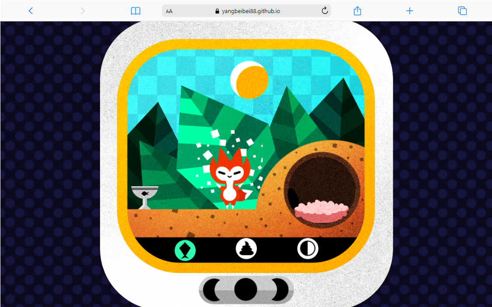

# Fox Game

## Overview
This application is an emulator of virtual pet toys in the 90s. The little fox in this game needs you to feed and clean up their poops from time to time.

## Built With
This project is built with HTML, CSS, Javascript, Parcel.
- HTML
- CSS
- Javascript
- Parcel

## Live Demo

Check out the live site [Fox Game](https://yangbeibei88.github.io/fox-game/).

## Features
- Defined state machine: init, hatching, idling, sleeping, eating, pooping, hungry, celebrating, dead.
- CSS Multip-Step animations and transitions
- Bundled with Parcel

## License
The code is licensed under [Apache 2.0](https://www.apache.org/licenses/LICENSE-2.0.txt).

## Contact
- Beibei Yang [beibeiyang88@hotmail.com](mailto:beibeiyang88@hotmail.com)
